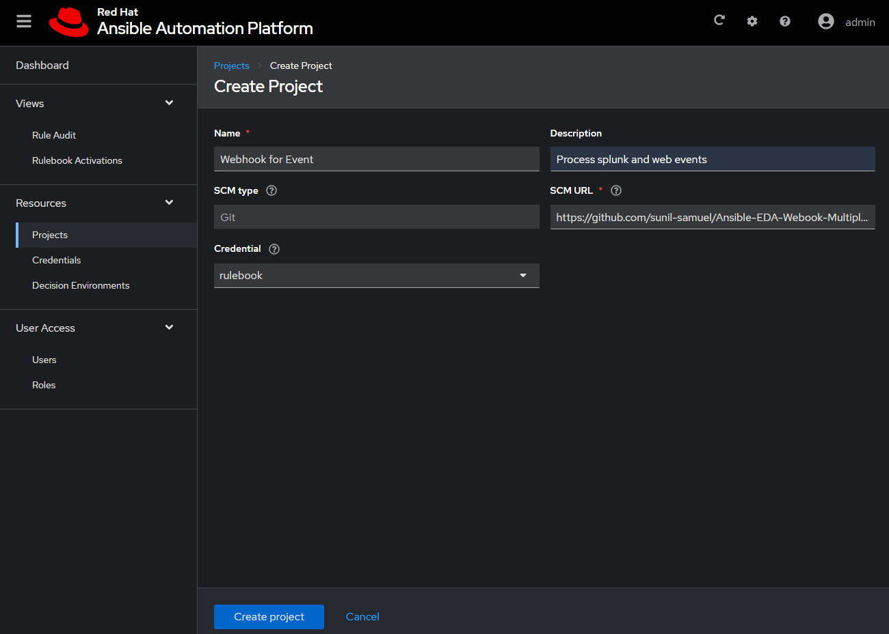
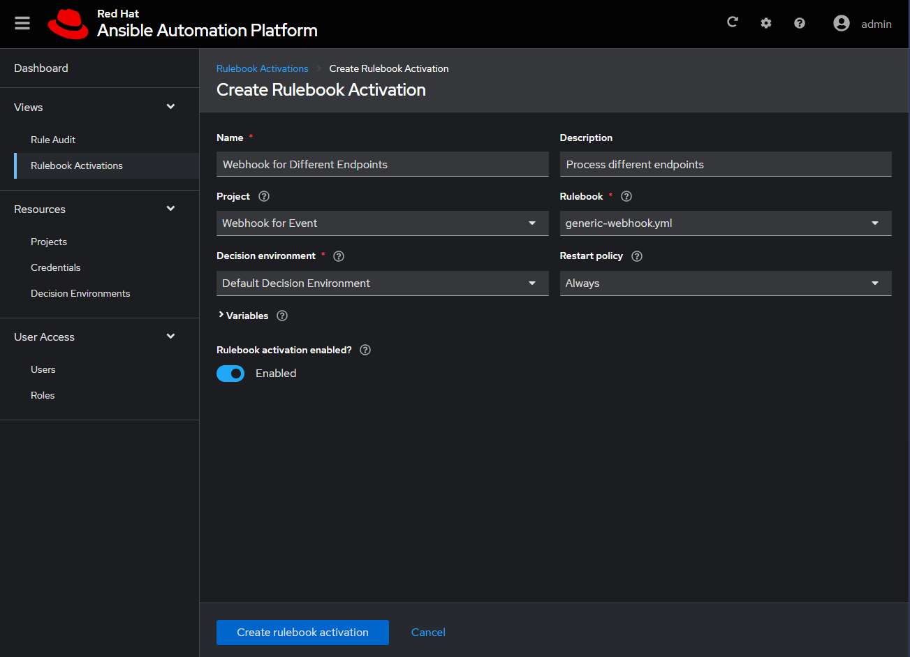

# eda.webhook - Listen on Different Endpoints

A sample rulebook that uses eda webhooks to listen for events.  Given the endpoint to
which the event is sent, call different playbooks to process the event.  The code
will delegate the events by sending the complete playload to the playbooks, which can
then do the processing.

## Running Locally

The script can be tested locally prior to creating an activation within the EDA UI.
This is useful to debug the playbooks.

### Install Rulebook

This assumes that you already installed python3 and pip and ansible.

Install ansible-rulebook an ansible.eda as follows:

```sh
%> pip install ansible-rulebook
%> ansible-galaxy collection install ansible.eda
```
### Run the Rulebook to Listen for Events

use `ansible-rulebook` to run the code.  Using the `-v` parameter will produce more
debug logs.

```sh
%> ansible-rulebook --rulebook rulebooks/generic-webhook.yml -i inventory.yml

2023-08-15 10:30:57,459 - ansible_rulebook.app - INFO - Starting sources
 ...
2023-08-15 10:30:58 331 [drools-async-evaluator-thread] INFO org.drools.ansible.rulebook.integration.api.io.RuleExecutorChannel - Async channel connected
```

### Send JSON Payload to Rulebook

use `curl` or similar tool to send a `POST` payload to the listening host.

Call the `splunk` endpoint as follows:
--------------------------------------

```sh
curl -d '{"summary": "Test to create TI issue from mule","description": "Mule Testing Jira Api one level of Module","type": "Incident","priority": "3-Medium","reporter": "ag","moduleMapLevels": {"parent": "Common to All Modules"}, "moduleMapAssets": [{"name": "Rates | IRD"},{"name": "CRD | CRD"}]}' -H "Content-Type: application" -X POST http://localhost:5000/splunk
```

Call the `web` endpoint as follows:
-----------------------------------

```sh
curl -d '{"warn":"2023-08-16T05:01:48.101-04:00  WARN 111934 --- [http-nio-0.0.0.0-8082-exec-5] o.s.web.servlet.PageNotFound : No mapping for GET /somepage.html"}' -H "Content-Type: application" -X POST http://localhost:5000/web

```

## Project and Activation from AAP EDA UI

Once everything looks good, configure the AAP EDA UI to create a project and a activiation.  This assumes
that you already installed AAP 2.4 that supports EDA.

### Create a Project

From the EDA AAP UI, create a Project as follows:


### Create an Activation

From the EDA AAP UI, create a Rulebook Activation as follows:
